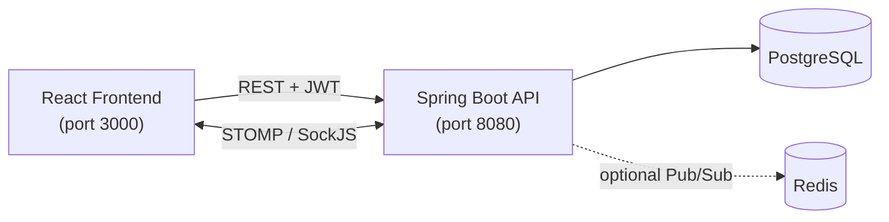

<div align="center">

# TaskFlow

### Distributed Task Management System

A full-stack Kanban app with real-time collaboration over WebSockets.


[Features](#-features) •
[Architecture](#-architecture) •
[Quick Start](#-quick-start) •
[API](#-api-reference) •
[WebSocket](#-websocket-events) •
[Troubleshooting](#-troubleshooting)

</div>

---

## ✨ Features

| | Feature | Details |
|---|---|---|
| 📋 | **Kanban boards** | Drag-and-drop tasks across configurable columns. New projects are seeded with *To Do*, *In Progress*, *Review* and *Done*. |
| ⚡ | **Real-time collaboration** | Board changes are broadcast live to everyone in the project via STOMP over SockJS. |
| 🔐 | **JWT authentication** | Access tokens plus an HTTP-only refresh cookie. |
| 👥 | **Role-based access control** | Admin and Manager roles gate sensitive actions such as deleting tasks and changing user roles. |
| 🛡️ | **Optimistic locking** | Task updates and moves use JPA `@Version`. A stale version returns `409 Conflict` with the `currentVersion`. |
| 🧾 | **Immutable audit log** | Every change is stored as a JSONB old/new value record that can never be edited. |
| ⏰ | **Deadline engine** | A scheduler runs every 15 minutes and feeds the notification system. |
| 🔔 | **Notifications** | Personal notification queue delivered over WebSocket and available via REST. |
| 📊 | **Analytics** | Project stats and an activity log page. |
| 🌐 | **Multi-node ready** | Optional Redis Pub/Sub for cross-node WebSocket broadcasting. |

---

## 🏗 Architecture



---

## 🚀 Quick Start

### Prerequisites

| Tool | Version | Download |
|---|---|---|
| Java | 17+ (LTS) | [adoptium.net](https://adoptium.net) |
| Node.js | 18+ (LTS) | [nodejs.org](https://nodejs.org) |
| PostgreSQL | 15+ | [postgresql.org](https://www.postgresql.org/download/) |
| Redis | 7+ *(optional)* | Only needed for multi-node WebSocket broadcasting |

> [!NOTE]
> You do **not** need to install Maven. The project ships with the Maven Wrapper (`mvnw` / `mvnw.cmd`), which downloads it automatically.

> [!TIP]
> Prefer containers? See [DOCKER.md](DOCKER.md) for the Docker setup.

### 1. Clone the repository

```bash
git clone https://github.com/HarshSh05/Taskflow.git
cd Taskflow
```

### 2. Set up PostgreSQL

Open a terminal and start `psql`:

```bash
psql -U postgres
```

Create the user and database:

```sql
CREATE USER taskflow WITH PASSWORD 'taskflow';
CREATE DATABASE taskflow_db OWNER taskflow;
\q
```

Load the schema and sample data from the repository root (password: `taskflow`):

```bash
psql -U taskflow -d taskflow_db -f database/schema.sql
```

### 3. Start the backend

Open **Terminal 1**:

```bash
cd backend
```

<details open>
<summary><b>macOS / Linux</b></summary>

```bash
chmod +x mvnw
./mvnw spring-boot:run
```

</details>

<details>
<summary><b>Windows</b></summary>

```bat
mvnw.cmd spring-boot:run
```

</details>

> [!NOTE]
> The first run downloads Maven and all dependencies (~100 MB) and takes 3-5 minutes. Later runs start in about 10 seconds.

Wait for `Started TaskFlowApplication in X seconds`. The API is now live at **http://localhost:8080**.

### 4. Start the frontend

Open **Terminal 2** and keep Terminal 1 running:

```bash
cd frontend
cp .env.example .env      # Windows: copy .env.example .env
npm install
npm start
```

The app opens automatically at **http://localhost:3000**.

### 5. Log in

| Field | Value |
|---|---|
| Email | `admin@taskflow.com` |
| Password | `admin123` |

> [!WARNING]
> These are demo credentials from the sample data. Change them before deploying anywhere public.

---

## 🔌 API Reference

All endpoints require `Authorization: Bearer <TOKEN>` except those under `/auth`.
Base path: `/api/v1`

### Auth

| Method | Endpoint | Description |
|---|---|---|
| `POST` | `/auth/register` | Create an account |
| `POST` | `/auth/login` | Log in and receive a JWT |
| `POST` | `/auth/refresh` | Refresh the token using the HTTP-only cookie |

### Projects and columns

| Method | Endpoint | Description |
|---|---|---|
| `GET` | `/projects` | List projects |
| `POST` | `/projects` | Create a project |
| `GET` | `/projects/{id}/board` | Get the full board |
| `PATCH` | `/projects/{id}/archived` | Archive or unarchive a project |
| `POST` | `/projects/{id}/columns` | Add a column |
| `PATCH` | `/projects/{id}/columns/{columnId}` | Update a column |
| `GET` | `/projects/{id}/audit` | View the audit trail |

### Tasks

| Method | Endpoint | Description |
|---|---|---|
| `GET` | `/projects/{id}/tasks` | List tasks in a project |
| `POST` | `/projects/{id}/tasks` | Create a task |
| `PATCH` | `/tasks/{id}` | Update a task *(requires the task `version`)* |
| `PATCH` | `/tasks/{id}/move` | Move a task *(requires `version`, returns `409` on conflict)* |
| `DELETE` | `/tasks/{id}` | Delete a task *(Manager / Admin only)* |

### Notifications and admin

| Method | Endpoint | Description |
|---|---|---|
| `GET` | `/users/me/notifications` | Get your notifications |
| `PATCH` | `/admin/users/{id}/role` | Change a user's role *(Admin only)* |

---

## 📡 WebSocket Events

**Connect:** `http://localhost:8080/ws?token=<JWT>` (authenticated SockJS)

| Destination | Purpose |
|---|---|
| `/topic/project/{id}` | Board events for a project |
| `/user/queue/notifications` | Your personal notifications |

**Board events:** `TASK_CREATED` · `TASK_UPDATED` · `TASK_MOVED` · `TASK_DELETED`

---

## ⚙️ Configuration

| Variable | Description |
|---|---|
| `REDIS_ENABLED` | Set to `true` when Redis is running to enable cross-node WebSocket event broadcasting |

Frontend settings live in `frontend/.env` (copy it from `frontend/.env.example`).

---

## 📁 Project Structure

```text
Taskflow/
├── backend/
│   ├── mvnw / mvnw.cmd                # Maven wrapper (no Maven install needed)
│   ├── pom.xml
│   └── src/main/
│       ├── java/com/taskflow/
│       │   ├── TaskFlowApplication.java
│       │   ├── config/                # SecurityConfig, WebSocketConfig, CorsConfig
│       │   ├── controller/            # Auth, Project, Task controllers...
│       │   ├── service/               # Business logic
│       │   ├── repository/            # JPA repositories (one per entity)
│       │   ├── entity/                # User, Project, BoardColumn, Task,
│       │   │                          # ProjectMember, ActivityLog, Notification
│       │   ├── dto/                   # Request and response DTOs
│       │   ├── security/              # JwtUtil, JwtAuthFilter, UserDetailsServiceImpl
│       │   └── exception/             # GlobalExceptionHandler + custom exceptions
│       └── resources/
│           └── application.properties
│
├── frontend/
│   └── src/
│       ├── App.jsx                    # Router setup
│       ├── index.js                   # Entry point
│       ├── pages/                     # Login, Signup, Dashboard,
│       │                              # Project (Kanban + drag-and-drop), Analytics
│       ├── components/                # Navbar, TaskModal, MembersPanel, ProtectedRoute
│       ├── services/                  # Axios client with JWT interceptors + API wrappers
│       ├── context/                   # AuthContext (JWT state)
│       └── websocket/                 # useWebSocket (STOMP client hook)
│
├── database/
│   └── schema.sql                     # PostgreSQL 15 tables, JSONB audit fields, indexes
│
├── docker-compose.yml
├── DOCKER.md
└── .env.example
```

---

## 🧰 Troubleshooting

| Problem | Fix |
|---|---|
| `mvnw.cmd is not recognized` | Make sure you are inside the `backend` folder, then run `mvnw.cmd spring-boot:run`. |
| `psql is not recognized` | Add PostgreSQL's `bin` folder to your `PATH`, then restart the terminal. |
| Port 8080 already in use | **Windows:** `netstat -ano \| findstr :8080`, then `taskkill /PID <number> /F`<br>**macOS / Linux:** `lsof -i :8080`, then `kill -9 <PID>` |
| `npm install` fails with `ERESOLVE` | Run `npm install --legacy-peer-deps`. |
| Blank React page | Check that `frontend/.env` exists. Stop `npm start`, fix the file, and start it again. |
| `Could not connect to WebSocket` | Start the backend first. The frontend expects it on port 8080. |

---
